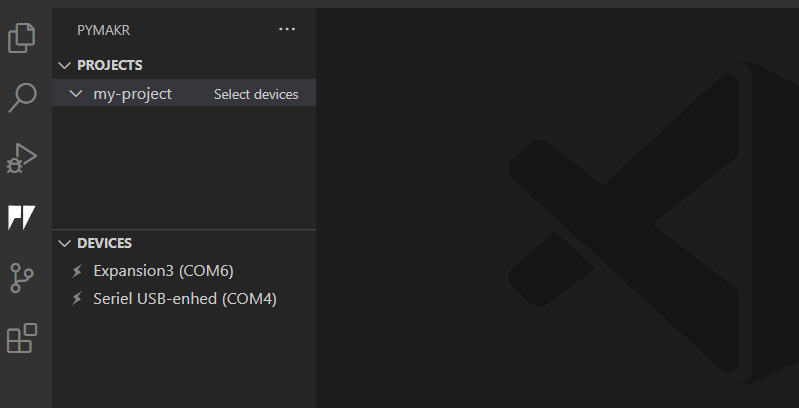
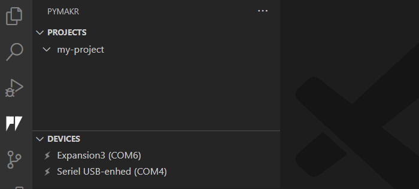
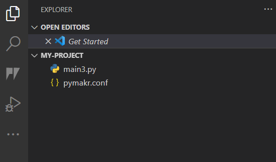

# Getting Started

1. First [download and install Visual Studio Code](https://code.visualstudio.com/).
2. Install the [Pymakr VSCode Extension](https://marketplace.visualstudio.com/items?itemName=pycom.Pymakr)
    
    _(We're installing the preview, but once the project reaches "stable" we'll, be using the regular extension.)_

    

3. That's it! You've installed the Pymakr Extension for VSCode

## Creating a project

Pymakr revolves around projects that can be uploaded to your devices. To create your first project click the `+` icon and select a folder for your project:


_Note: If a project is created outside the current workspace(s), its folder will be mounted as a new workspace._

## Creating a script

Below we add a `main.py`. Once uploaded to a device, this file will run whenever the device is reset.



## Upload the project to a device

Once the project is ready to run, it needs to be uploaded to a device.



---

## Developer mode - Experimental

To speed up development, you can put a project in `development mode`.

In development mode, Pymakr automatically propagates file changes in and restarts the main script.

Dev mode can be configured in `pymakr.json`
```json
{
    "onUpdate": "restartScript" | "softRestartDevice" | "hardRestartDevice"
}
```

**onUpdate:** Action to be called once file changes have been propagated.
- **restartScript** Clears the `main.py` module as well as any changed modules. Then imports `boot.py` and `main.py`.
- **softRestartDevice** Performs <kbd>ctrl + d</kbd>
- **hardRestartDevice** Performs `machine.reset()`

#### NOTE
*`machine.sleep` and `machine.deepsleep` do not work in development since they stop the USB connection.*

---

## Hint: Organizing your setup

Having to switch between different tabs can be cumbersome. To solve this, you can drag your devices and projects to the file explorer view.

